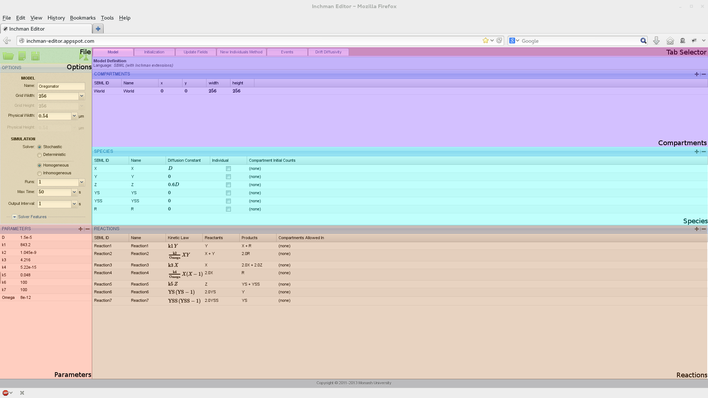
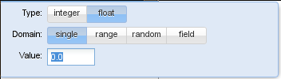

.. _section-editor:

Editor
======

The Inchman editor is, for most user groups, the main point of entry to the Inchman system. Users can build complete spatial reaction-drift-diffusion networks from scratch and save the models to a :ref:`spatially-annotated SBML file <section-sbml>`. The editor strives to keep the original SBML intact as much as possible to allow users to build non-spatial models using third-party software and use the Inchman editor to amend the SBML file with spatial and Inchman-specific information.

Running the editor
------------------

The editor is completely web-based and as such no installation is required. The only prerequisites are a modern browser (the interface has been tested with Firefox and Chrome) with Javascript enabled. The editor is based on Google App Engine and lives at http://inchman-editor.appspot.com

The main window consists of seven different regions which we will explain in detail now.

File Panel
----------

The user can create new files, upload existing SBML files (with or without spatial and Inchman-specific information) or download an :ref:`amended SBML file <section-sbml>`. The downloaded file can be archived, it can be used as a template for scripted simulations or it can be run using the :ref:`command line client <section-inchman>`. The current experiment can be submitted directly using the |simulate| button.

.. note ::

   When the user submits the experiment by pressing the simulate button, the editor internally creates an SBML file and sends a link to this file back to the browser. The link is of the form ::

     inchman://simulate/<global id>

   and uses the specific protocol ``inchman://`` for communication between the browser and the editor. If you are using Inchman for the first time, or if you are using a different browser, you will get a message which asks you to specify the program for this protocol. You will then have to point the browser to the location of the :ref:`Inchman Python wrapper script <inchman-wrapper>` (for example ``/usr/local/bin/inchman``). This choice can be changed at any time by going to Preferences->Applications in your browser and look for the Inchman protocol. 

Options
-------

.. _options:

The options panel serves to assign a model name, the number of subvolumes per dimension (``GridWidth``) and the size of the integration domain in physical units (:math:`\mu\mathrm{m}`).

.. note ::

   Currently only square integration domains are supported. Although the size is by default given in :math:`\mu\mathrm{m}`, the user can choose any base units. The only time when this information is used, is when Inchman computes the cell transition probabilites from the :ref:`diffusivity-drift method <drift_diffusivity_method>` or from the diffusivity given in the :ref:`species panel <species>`. Hence, if the base unit here is assumed to be, say, :math:`\mathrm{cm}`, the diffusivity would be given in :math:`\mathrm{cm}^2\mathrm{s}^{-1}` and the drift coefficient would have dimensions :math:`\mathrm{cm}\ \mathrm{s}^{-1}`. The user does not have to change the base units explicitly, she only needs to consistently define the diffusivity and drift.

Inchman supports stochastic and deterministic simulations. The deterministic solver computes a solution to the :ref:`Fokker-Planck Equation <section-reaction-drift-diffusion-systems>` which can be used to check the output of the stochastic simulation.

.. note ::

   The deterministic solver is neither optimized for speed nor numerical stability. It serves only as a quick-and-dirty tool to check if the results of the stochastic simulation make sense. A lot of specialized tools exist to compute solutions to the multivariate Fokker-Planck equation which will usually be quicker and more reliable.

The user an also choose between a solver optimized for *homogeneous systems without drift* and the more versatile inhomogeneous solver. The inhomogeneous solver supports drift, a :ref:`custom diffusivity-drift method <drift_diffusivity_method>` and anisotropic diffusivity.

Finally, the user can provide the number of runs per experiment (the random number generated is re-seeded for each run such that in a stochastic simulation, all runs will yield different outputs), the physical runtime and the time interval for output dumps.

.. _parameters:

Parameters
----------

The parameters panel allows the user to define custom parameters which can the be used in the simulation. In particular, parameters are available in the :ref:`homogeneous diffusion field <species>`, the rate law in the :ref:`reactions panel <reactions>`, the :ref:`inhomogeneous drift-diffusivity method <drift_diffusivity_method>`, the :ref:`initialization method <initialization>`, the :ref:`events method <events>` and the :ref:`update fields <update_fields>` method. Moreover, the user can loop over parameters and thus set up parameter-sweep experiments.

To define a new parameter, the user can click the |plus| button. A standard parameter is then added to the parameter list. The user can change the name of the new parameter by clicking on the current name and its value by clicking on the currently assigned value. In this case, a little window pops up where the user can define if the parameter is an integer or a real value. He can also select the domain of the parameter to be either a single parameter, a parameter range (over which Inchman will loop regularly), a parameter range from which a number of random points is selected or a field parameter.

.. _field_parameter:

A field parameter denotes a field of real values with the same dimensions as the simulation domain, i.e. ``gridWidth x gridWidth``. The field values are initialized in the :ref:`initialization method <initialization>` and can be periodically updated in the :ref:`update fields method <update_fields>`. An example of how field parameters can be used is given in the :ref:`SLIT tutorial <tutorial_slit>`.

Compartments
------------

The user can define compartments in this panel. New compartments can be added and existing compartments can be removed by using the plus and minus buttons. Each compartment has an SBML ID (by which it will be identified) and a human-readable name. The position in the grid is defined by its x and y position and the width and height accordingly. Note that the position and size of the compartment is given in grid units, i.e. subvolumes. The position and size can also depend on any parameters defined in the :ref:`parameter panel <parameters>`.

.. warning::
   
   Compartments in the SBML standard differ markedly from our use of compartments. In particular, SBML compartments are topological and do not contain any spatial information. Moreover, the SBML standard requires each species to reside in a particular compartment. Inchman does not support species which are confined to a compartment. Insted, Inchman assumes that all species live in a compartment "World". This compartment needs to be defined here. Usually, one would set the World compartment at position ``(0,0)`` and assign a size that covers the whole grid. If the "World" compartment is not present, the command-line client fails to read in the model file.

.. _species:

Species
-------

Species are added and removed using this panel. Each species has an SBML ID, by which it is referred to in the rate law etc., and a user-readable name. The diffusivity of the species for the *homogeneous solver* can be set here. The user can also specify how many entities of the species are initially in a particular compartment.

.. note::
   The diffusivity set here is only used in connection with the homogeneous solver. For inhomogeneous models, or those involving drift, the diffusivity and drift needs to be set in the :ref:`inhomogeneous drift-diffusivity method <drift_diffusivity_method>`.

.. note::

   You can use any :ref:`model parameter <parameters>` in the diffusivity field and you can even do maths with it. For example, to set the diffusivity of a particular species to :math:`0.6 D`, just enter ``0.6*D`` in the equation line. You can check if the equation was interpreted correctly by looking at the generated Math-ML code in the lower box. You can also enter your equation using Math-ML here.

.. _individuals:

Individual species
""""""""""""""""""

Individual species are an experimental feature that allow the user to track individual entities. Any species can be marked as "individual" by ticking the according box in the species list. For each individual species, Inchman holds a list of individual parameters, namely the diffusivity and drift in each direction. Inchman keeps track of the subvolume location each individual resides in and the individual parameters can be changed in the :ref:`inhomogeneous drift-diffusivity method <drift_diffusivity_method>`. Individuals can also partake in reactions. If a reaction results in a new individual to be created, the method :ref:`New Individuals Method <new-individuals>` is called. Examples of how to use the individual interface are the :ref:`individual reaction example <example-ab-reaction-individual>`, the :ref:`individual Fisher problem example <example-fisher-individual>`, the :ref:`Homogeneous Drift - Individual example <example-drift-individual>` and the :ref:`New individual test exampe <example-ab-reaction-individual-new>`. Some technical details of how the individual solver was implemented can be found in :ref:`section-individuals`.

.. note ::

   Although the individual solver has been subjected to a number of tests it is still to be considered an experimental feature. Moreover, since Inchman needs to keep track of the position of each individual, including individual species will considerably slow down the simulation. Finally, the number of individuals of each species is bound to a hard limit (currently 262144 individuals per species).

.. _reactions:

Reactions
---------

All reactions between species are defined in this panel. Reactions have an SBML ID, a user-readable name and can be restricted to particular compartments if needed. The stoichiometry of the reaction, i.e. the reactants and the products are set by clicking on the corresponding fields. The kinetic law has to be set by the user and can involve parameters and any number of mathematical operations (an example for complicated kinetic laws such as Michaelis-Menten-type reactions can be found in the :ref:`Intracellular Calcium Waves model <example-calcium>`).

.. note ::

   Inchman does not automatically generated a mass-action kinetic law and you have to explicitly indicate the species involved in the kinetic law. The dimension of the whole expression in the kinetic law box needs to be :math:`[\mathrm{s}^{-1}]`. If, as common in the chemical and biological literature, the reaction coefficient is given in units of molar concentration :math:`\mu\mathrm{M}=10^{-6} \mathrm{mol}\ \mathrm{l}^{-3}`, you will need to convert it using the subvolume size and the Avogadro number. The following table should give some hints as how to enter common mass-action kinetic laws (provided we set a parameter ``Na`` to the Avogadro constant).

   =====  =======  ========================  ==================
   Order  Formula  dimension of coefficient  Inchman expression 
   =====  =======  ========================  ==================
   0      |f0|     |c0|                      |e0|
   1      |f1|     |c1|                      |e1|
   2      |f2|     |c2|                      |e2|
   2      |f2a|    |c2a|                     |e2a|
   =====  =======  ========================  ==================

.. |e0| replace:: ``Na*1e-3*PhysicalCellWidth^3``
.. |f0| replace:: :math:`\emptyset \xrightarrow{k} \cdots`
.. |c0| replace:: :math:`[k]=\mu\mathrm{M}\ \mathrm{s}^{-1}`
.. |f1| replace:: :math:`A \xrightarrow{k} \cdots`
.. |c1| replace:: :math:`[k]=\mathrm{s}^{-1}`
.. |e1| replace:: ``A``		  
.. |f2| replace:: :math:`A + B \xrightarrow{k} \cdots`
.. |c2| replace:: :math:`[k]=\mu\mathrm{M}^{-1}\ \mathrm{s}^{-1}`
.. |e2| replace:: ``A*B/(Na*1e-3*PhysicalCellWidth^3)``
.. |f2a| replace:: :math:`A + A \xrightarrow{k} \cdots`
.. |c2a| replace:: :math:`[k]=\mu\mathrm{M}^{-1}\ \mathrm{s}^{-1}`
.. |e2a| replace:: ``A*(A-1)/(2*Na*1e-3*PhysicalCellWidth^3)``

You can confine reactions to particular compartments by clicking the "compartments allowed in" column and adding the corresponding compartment. If no compartment is selected, the reaction is allowed in the whole domain.

.. note ::
  
  Localization of reactions, i.e. constricting reactions to compartments, is achieved internally by using textures. This functionality is not available for old graphics card, like older iMacs, and you will get an Open-CL error. In this case, you will have to set up your simulation without localization.

.. _initialization:

Initialization
--------------

This tab allows the user to provide highly sophisticated initial conditions. The user provides in this tab a `Python <http://www.python.org/>`_ script which sets the initial conditions accordingly. Examples that use this method to initialize the simulations are the :ref:`Fisher problem <example-fisher>`, the :ref:`BZ reaction <tutorial_bz_reaction>` and the :ref:`Intracellular Calcium Waves model <example-calcium>`.

The following code block can be used as a template for own models:

.. code-block:: python

   import numpy

   # extract some parameters we need
   nx = runtimeInformation['nx']
   ny = runtimeInformation['ny']
   nSpecies = runtimeInformation['nspecies']

   # make a numpy array out of it
   if (runtimeInformation['solver']=='stochastic_homogeneous'):
     # we have a stochastic simulation going
     numpy_state = numpy.array(state, copy=False)
   else:
     # this is for the deterministic simulation
     numpy_state = numpy.array(deterministicState, copy=False)

   # reshape the array
   np_state_new = numpy_state.reshape(nSpecies, nx, ny)

   # zero the array
   np_state_new[:,:,:] = 0

   # set species 'A' to value '1' in each subvolume
   np_state_new[species['X'], :, : ] = 1

We strongly urge the reader to become familiar with Python and `Numpy <http://www.numpy.org/>`_ if he is not so already as an exact explanation of how this snippet works is out of the scope of this manual. Please also have a look at the :ref:`BZ reaction tutorial <tutorial_bz_reaction>` and the examples.

Drift-Diffusivity Method
------------------------
.. _drift_diffusivity_method:

This tab is only available if the inhomogeneous solver was selected. Here, the user can provide the diffusivity and drift for each species. In the most simple case, all species have the same diffusivity and drift (compare the :ref:`homogeneous diffusivity and drift example <example-drift>`). This can be achieved by entering ::

  All->DiffusivityX = 0.6;
  All->DiffusivityY = 0.8;
  All->DriftX = 0.8;
  All->DriftY = 0.4;

The keyword ``All`` stands for all species, ``->`` is the assignment operator and ``DiffusivityX`` denotes the diffusivity in x direction. **Note the compulsory semicolon at the end of each line!**

.. note ::
  The astute reader might notice that this looks a lot like C code - and in fact it is. Internally, this method will be copied into a template file and compiled by the Open-CL runtime compiler. Users familiar with C programming can benefit from the full functionality provided by a high level language to perform sophisticated calculations here. A more complicated example of how to make use of this capability is given in the :ref:`SLIT tutorial <tutorial_slit>`. Inchman also stores the complete Open-CL code for the different solvers in the current working directory (filenames start with ``_final_code_``). This is very useful for debugging purposes. Also, if the Open-CL compiler fails, the line numbers refer to these files.

Species can be assigned individual diffusivity and drift values by simple replacing the ``All`` keyword with the species name, as in ::

  A->DiffusivityX = 0.6;

for species A. 

Users have also full access to all parameters defined in the :ref:`parameter panel<parameters>` and the following system parameters and helper functions:

====================================   ==============================================================================================================
Parameter                              Meaning
====================================   ==============================================================================================================
``GridModelWidth``                     Width of the computation grid
``GridModelHeight``                    Height of the computation grid
``PhysicalModelWidth``                 Domain width in physical units 
``PhysicalModelHeight``                Domain height in physical units
``PhysicalCellWidth``                  Cell width in physical units
``PhysicalCellHeight``                 Cell height in physical units
``PhysicalSimTime``                    The current simulation time
``NumReactions``                       Number of reactions
``NumSpecies``                         Number of species
``GridX``                              x position on the computation grid
``GridY``                              y position on the computation grid
``PhysicalX``                          x position on the domain in physical units (see :ref:`coordinate_system`)
``PhysicalY``                          y position on the domain in physical units (see :ref:`coordinate_system`)
``<species>->State``                   Species count for species ``<species>`` at current grid position
``<species>->MeanX``                   Global mean x position of species ``<species>`` in physical units (only available if the "Compute Moments" box is checked)
``getCentralDifferenceX(<species>)``   Computes the central difference of the species count in X direction (see :ref:`SLIT tutorial <tutorial_slit>`)
``getCentralDifferenceY(<species>)``   Computes the central difference of the species count in X direction (see :ref:`SLIT tutorial <tutorial_slit>`)
====================================   ==============================================================================================================

The user can access advanced functionality by unfolding the "advanced" tab at the top of the window. The available functionality is:

* Re-Compute Drift Diffusivity after each time-step. If the values for the drift and the diffusivity stay constant over time, the simulation can be sped up considerably by unchecking this box.
* Compute moments. The :ref:`non-linear diffusivity and drift example <example-nonlinear>` requires the mean value of the species in x direction. This can be computed by checking this box.

.. _coordinate_system:

Setting up a coordinate system
""""""""""""""""""""""""""""""

So far, all examples set the diffusivity and drift homogeneously over the whole domain. Inchman unfolds its full strength, however, when dealing with inhomogeneous diffusivity and drift fields. For this purpose, users can set up a coordinate system on which the diffusivity and drift fields can depend on.

Internally, the drift and diffusivity is computed for each species and each grid cell (subvolume) separately. That means that the expression ``A->DiffusivityX`` implicitly refers to the diffusivity in X direction at the current grid cell. Likewise, the expression ``A->State`` denotes the number of particles of species A at the current grid cell. The current position on the grid can be accessed using the variables ``GridX`` and ``GridY``. A standard coordinate system, where the origin is centered on the grid, is also available through the variables ``PhysicalX`` and ``PhysicalY``.

We have a look at how the :ref:`non-linear diffusivity and drift example <example-nonlinear>` computes the diffusivity and drift. First, the diffusivity is constant over the whole grid:

.. code-block:: c

  // diffusivity is constant
  All->DiffusivityX = diffx;
  All->DiffusivityY = diffy;

We then use the physical coordinate system provided by Inchman to set up a coordinate system where the origin is shifted by the user-defined parameter ``origin``:

.. code-block:: c

  Real shiftedX = PhysicalX + origin;
  Real shiftedMeanX = All->MeanX + origin;

This coordinate system can then be used to compute the non-linear drift:

.. code-block:: c
  
  All->DriftX = -(omega * shiftedX + theta*shiftedMeanX);
  All->DriftY = 0.0;

.. _events:

Events
------

This panel allows the user to define a number of events. Events can be added and removed on the left side of the split window. At each event, the corresponding python script, which is assigned on the right side, is executed. Here, the user can change the state field and field variable. **Note that parameters are fixed over the whole simulation and cannot be changed here**. The syntax of the event scripts is exactly the same as in the section :ref:`initialization`.

.. _update_fields:

Update Fields
-------------

This panel is useful if the model contains :ref:`field parameters <field_parameter>`. Here, the user can provide a method to periodically update the fields. The routine is called after each diffusion step and the time that has passed since the last update is available in the variable ``dt``. An example of how to use this method is found in the example :ref:`example-drift-field`:

.. code-block:: c

   traceField = A/dt;

The field parameter ``traceField`` is updated by the local count of species A in each time period.

.. warning ::
   
   Note that several diffusion steps might occur at the same time. In this case, the time step ``dt`` might be zero. The user should explicitly take care of this possibility.

.. _new-individuals:

New Individuals
---------------

If the model contains :ref:`individual species <individuals>`, this method is called each time a new individual is created by a reaction. Here, the user can set the properties of the newly created individual. An example of how to do this can be found in :ref:`example-ab-reaction-individual-new`. The code used to set the diffusivity and drift for the new individual is

.. code-block:: c

   All->DiffusivityX = RANDOM;
   All->DiffusivityY = RANDOM;
   All->DriftX = RANDOM;
   All->DriftY = RANDOM;

The keyword ``RANDOM`` yields a uniformly distributed random number in the interval :math:`[0,1]`.

