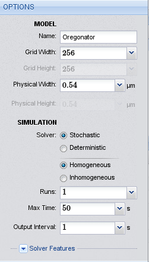
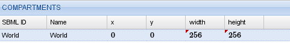
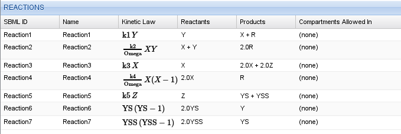
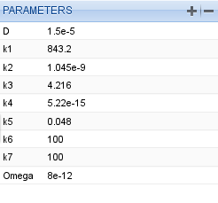
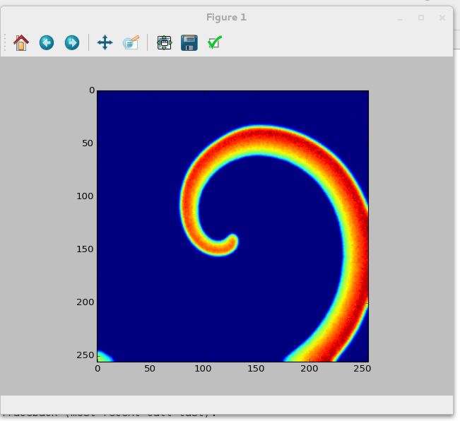
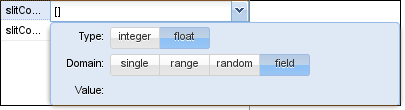
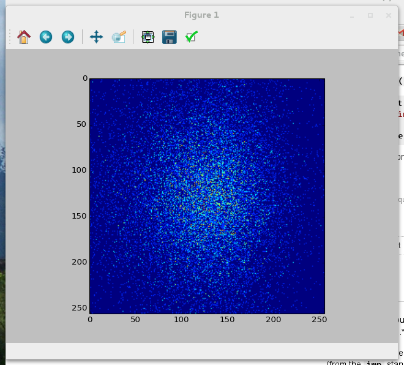

Tutorials
========================

.. _tutorial_bz_reaction:

The Belousov-Zhabotinsky reaction
---------------------------------

Introduction
^^^^^^^^^^^^
In this tutorial we will implement the `Oregonator <http://www.scholarpedia.org/article/Oregonator>`_ model of the famous `Belousov-Zhabotinsky <http://en.wikipedia.org/wiki/Belousov%E2%80%93Zhabotinsky_reaction>`_ reaction, a nice example of a nonlinear reaction-diffusion system that displays complex patterns. Details of the Inchman implementation of this model, and the scientific background for it, can be found in our publication [Patterns]_.

The Oregonator model consists of the reaction scheme:

.. math::
   Y   & \xrightarrow{k_1}          & X + R \\
      X+Y & \xrightarrow{k_2/\Omega} & 2 R \\
      X   & \xrightarrow{k_3}          & 2 X + 2 Z \\
      2 X & \xrightarrow{k_4/\Omega} & R \\
      Z   &  \xrightarrow{k_5}         & Y^\ast + Y^{\ast\ast}\\
      2 Y^\ast & \xrightarrow{k_6} & Y \\
      2 Y^{\ast\ast} & \xrightarrow{k_7} & Y^\ast
   :label: oregonator

for the reactants :math:`X`, :math:`Y`, :math:`Z`, the helper species :math:`Y^\ast` and :math:`Y^{\ast\ast}` and the remainder species :math:`R`. The helper species are introduced to avoid fractional stoichiometries, which Inchman does not support currently. The parameter :math:`\Omega`, which mimics the expansion parameter in the :math:`\Omega`-expansion, will be used to scale the overall species number and hence demonstrate the transition between a stochastic and a pseudo-deterministic setting. Please refer to the original paper [Patterns]_ for more details on the reaction system, our implementation, pattern formation and the :math:`\Omega`-expansion.

Setting up the model
^^^^^^^^^^^^^^^^^^^^

   *Options for the Oregonator model*

We start the project by pointing our browser to the Inchman editor, which is located at http://inchman-editor.appspot.com/. We call the model "Oregonator", set the grid width to 64 and the physical length to :math:`0.54\ \mu m`. We need the stochastic homogeneous solver. The maximum run time is 5 seconds and we only perform one run.

The next step is to define the spatial compartments. We will set our initial conditions to create a spiral wave using a Python script so, for now, we only need the compulsory World compartment. We add it using the |plus| button in the compartment list.

	    
   *Compartments for the oregonator model*

.. sidebar:: Using model parameters in the diffusivity field
	     
   You can use any model parameter in the diffusivity field and you can even do maths with it. For example, to set the diffusivity of :math:`Z` to :math:`0.6 D`, just enter ``0.6*D``.

We now add the required species. Remember that we need six species in total:  :math:`X`, :math:`Y`, :math:`Z`, the helper species :math:`Y^\ast` and :math:`Y^{\ast\ast}` and the remainder species :math:`R`. None of the species should be treated as individuals so we uncheck this box. We set the diffusivity for species :math:`X` to a parameter :math:`D` and the diffusivity for :math:`Z` to :math:`0.6 D`.

The next step is to enter the reactions given by equations :eq:`oregonator`. Keep in mind, that reactions of the form :math:`2 Y^\ast \rightarrow Y` will have a kinetic law of :math:`k Y^\ast (Y^\ast-1)`. Again, you can use parameters and maths in the kinetic law. For example, to enter the second equation, you would type ``k2/Omega*X*Y``. Your complete reaction table should look like this.

   
   *Reaction table for the Oregonator model*

We set the parameters to the values of Table 6 from the research paper [Patterns]_.

   *Parameter table for the Oregonator model*

Finally, we need to trigger the formation of a spiral wave using the initial conditions. This is done by initializing a wedge-shaped perturbation in the field. Again, we ask you to consult the research paper for details on this. This tutorial only focuses on how to implement it in Inchman. The initial conditions are set in the "Initialization" tab of the editor. This tab accepts a Python script which looks as follows (you can copy and paste this part into the initialization tab of the editor window):

.. code-block:: python

  import numpy
  import sys
  import math

  # extract some parameters we need
  nx = runtimeInformation['nx']
  ny = runtimeInformation['ny']
  nSpecies = runtimeInformation['nspecies']

  scale = parameters['Omega']
  k1 = parameters['k1']
  k2 = parameters['k2']/scale
  k3 = parameters['k3']
  k4 = parameters['k4']/scale
  k5 = parameters['k5']
  k6 = parameters['k6']

  # make a numpy array out of it
  if (runtimeInformation['solver']=='stochastic_homogeneous'):
    # we have a stochastic simulation going
    print "Detected stochastic simulation!"
    numpy_state = numpy.array(state, copy=False)
  else:
    # this is for the deterministic simulation
    print "Detected deterministic simulation!"
    numpy_state = numpy.array(deterministicState, copy=False)

  # reshape the array
  np_state_new = numpy_state.reshape(nSpecies, nx, ny)

  # zero the array
  np_state_new[:,:,:] = 0

  #Initialize the "wedge"

  # create coordinate system
  xc=range(-nx/2, ny/2)
  yc=range(-nx/2, ny/2)
  gxc=numpy.outer(xc, numpy.ones_like(xc))
  gyc=numpy.outer(numpy.ones_like(yc), yc)
  theta = numpy.arctan2(gyc, gxc) + numpy.pi

  # create float arrays (for stochastic sim)
  nsf = numpy.zeros(numpy.shape(np_state_new), dtype=float)

  q = 0.002;
  f = 1.5;
  uss = 0.5*(1.-(f+q)+numpy.sqrt((f+q-1.)**2+4.*q*(1.+f)))

  tindex = numpy.where(theta<0.5)
  nsf[species['X'], :, : ] = uss
  nsf[species['X'], tindex[0], tindex[1] ] = 0.8

  # v = vss + theta/(8 pi f)
  nsf[species['Z'], :, : ] = uss + theta/(8.*numpy.pi*f)

  # and for Y we take the dynamic equilibrium value
  nsf[species['Y'], :, :] = f * nsf[species['Z'], :, : ]/(q + nsf[species['X'], :, : ])

  # and convert all to dimensional values
  np_state_new[species['X'], :, : ] = nsf[species['X'], :, : ] / (2.*k4/k3)
  np_state_new[species['Y'], :, : ] = nsf[species['Y'], :, : ] * (k3/k2)
  np_state_new[species['Z'], :, : ] = nsf[species['Z'], :, : ] / (k5*k4/k3**2)

We go through the code step by step. The first snippet loads some useful modules and extracts the simulation parameters from the global namespace. Note that simulation internal parameters (such as the grid parameters) are specified in the dictionary ``runtimeInformation`` while the user-defined parameters live in ``parameters``.

.. code-block:: python

   import numpy
   import sys
   import math

   # extract some parameters we need
   nx = runtimeInformation['nx']
   ny = runtimeInformation['ny']
   nSpecies = runtimeInformation['nspecies']

   scale = parameters['Omega']
   k1 = parameters['k1']
   k2 = parameters['k2']/scale
   k3 = parameters['k3']
   k4 = parameters['k4']/scale
   k5 = parameters['k5']
   k6 = parameters['k6']

The next part converts the general memory pointer to a Numpy array (`Numpy <http://www.numpy.org/">`_ is a Python library to deal with arrays). The parameters ``nSpecies``, ``nx`` and ``ny`` were previously extracted from the ``runtimeInformation`` array.

.. code-block:: python

   # make a numpy array out of it
   if (runtimeInformation['solver']=='stochastic_homogeneous'):
     # we have a stochastic simulation going
     print "Detected stochastic simulation!"
     numpy_state = numpy.array(state, copy=False)
   else:
     # this is for the deterministic simulation
     print "Detected deterministic simulation!"
     numpy_state = numpy.array(deterministicState, copy=False)

   # reshape the array
   np_state_new = numpy_state.reshape(nSpecies, nx, ny)

   # zero the array
   np_state_new[:,:,:] = 0

To set up a regular-grid coordinate system which originates in the center cell you can use this snippet:

.. code-block:: python

   # create coordinate system
   xc=range(-nx/2, ny/2)
   yc=range(-nx/2, ny/2)
   gxc=numpy.outer(xc, numpy.ones_like(xc))
   gyc=numpy.outer(numpy.ones_like(yc), yc)

The arrays ``gxc`` and ``gyc`` will now contain a regular grid, which you can use to set up your initial conditions.

The last bit initializes the wedge by setting the arrays for the species individually. A detailed description of this code is outside the scope of this tutorial. Instead, we invite the reader to consult to the Python and Numpy documentation.

Running the simulation and analyzing the output
^^^^^^^^^^^^^^^^^^^^^^^^^^^^^^^^^^^^^^^^^^^^^^^

You can now save the model to your harddrive or directly simulate it by clicking on the |simulate| button. Depending on your hardware, this might take some time, in particular if the scale parameter :math:`\Omega` is large.

Once the simulation is finished we can analyze the results. The simulation output is stored in an `HDF5 <http://www.hdfgroup.org/HDF5/>`_ file. HDF5 readers are available for Matlab, Mathematica and various programming languages. For interactive sessions, we use the Python modules which come with Inchman.

After starting Python, we first load the Inchman input/output module along with Numpy and Matplotlib.

   >>> import gpgmp.io
   >>> import matplotlib.pyplot as plt
   >>> import numpy

The io module reads out the results from the HDF5 file and converts it into Numpy arrays.

   >>> n, times, species, nruns = gpgmp.io.read_gmp_hdf5('output')

The output time stamps are stored lexically so we first need to sort them numerically:

   >>> tind = numpy.argsort(times)
   >>> times[tind[-1]]

The species array tells us at which index a particular species is. We would like to plot species X:

   >>> species
   array(['X', 'Y', 'Z', 'YS', 'YSS', 'R'], dtype=object)
   >>> plt.imshow(n[0,tind[-1],0,:,:])
   <matplotlib.image.AxesImage object at 0x208ded0>
   >>> plt.show()

If everything went correctly, your output should show a nice spiral similar to this one: 

	    
   *Spiral wave in the Oregonator model*

.. _tutorial_slit:

Migration of neurons in the brain
---------------------------------

Introduction
^^^^^^^^^^^^

his tutorial is build around an application from mathematical biology. The question we are addressing here is how a signalling molecule, Slit, affects migrating neurons in the brain. Details about the biological background and the reasoning behind our implementation can be found in our paper [Vigelius2012a]_.

The main ingredient of our model are the migrating cells which move according to the stochastic differential equation

.. math::

  \mathrm{d} \mathbf{X}_t= - \mathbf{\nabla} d(\mathbf{X}_t) \, \mathrm{d}t +\left[2 d(\mathbf{X}_t)\right]^{1/2} \mathbf{I} \, \mathrm{d} \mathbf{W}_t,

i.e. the drift and diffusivity can be derived from a single scalar function

.. math::
    d(s,u) = d_\mathrm{cc}(u) d_\mathrm{cs}(s) = D_0 \frac{A}{A+u} \exp(-\beta s),

which combines the cell-cell interaction :math:`d_\mathrm{cc}(u)` and the cell-Slit interaction :math:`d_\mathrm{cs}(s)`. :math:`u` denotes the local concentration of the cells while :math:`s` refers to the Slit concentration. We assume that, in the experiment, the Slit concentration attained a steady state and can be described by

.. math::
  s(x) = \left\{
      \begin{array}{rl}
        0, & 0 \le t < t_a, \\
        s_0\ \mathrm{exp}(-\lambda |x-L|), & t \ge t_a,
      \end{array}
  \right.
where :math:`t_a` denotes the time when slit is applied to the experiment.

Setting up the model
^^^^^^^^^^^^^^^^^^^^

We start by setting up the experiment parameters, the World compartment and the species (Slit):

.. image:: images/Slit.png
   :width: 100%

Note that we have two field parameters here: ``slitConcentration`` and ``slitConcentrationD`` which describe the concentration of Slit and its derivative in the x-direction. Parameters can be marked as field parameters by selecting the according button in the domain window:

We initialize the species array by setting up a circular explant in the center of the domain:

.. code-block:: python
   :linenos: 

   # This python code snippet serves to initialize the species array
   import numpy

   # extract some parameters we need
   nx = runtimeInformation['nx']
   ny = runtimeInformation['ny']
   length = runtimeInformation['le ngth']
   nSpecies = runtimeInformation['nspecies']

   # make a numpy array out of it
   if (runtimeInformation['solver']=='stochastic_inhomogeneous') or (runtimeInformation['solver']=='stochastic_homogeneous'):
     # we have a stochastic simulation going
     numpy_state = numpy.array(state, copy=False)
   else:
     # this is for the deterministic simulation
     numpy_state = numpy.array(deterministicState, copy=False)

   # reshape the array
   np_state_new = numpy_state.reshape(nSpecies, nx, ny)

   # set background
   ntemp = np_state_new[species['Cells'],:,:]
   ntemp[:,:] = 0
    
   # concentration (from Cai)
   hcai = 5. # 5 mum is the cell size
   h = length/float(nx)
   u0 = 14./hcai**2
    
   # compute coordinate system
   xc=numpy.mgrid[-nx/2:nx/2]/float(nx)*length
   yc=numpy.mgrid[-nx/2:nx/2]/float(nx)*length
   gxc=numpy.outer(numpy.ones_like(xc), xc)
   gyc=numpy.outer(yc, numpy.ones_like(yc))
   rs = gxc**2+gyc**2

   # and set explant value in the middle
   r0 = 100.
   ntemp[numpy.where(rs<=r0**2)] = u0*h**2

   # finally we need to set the field variables
   lambd = parameters["lambda"]
   L = length/2.
   slitConcentration = (numpy.array(parameters["slitConcentration"], copy=False)).reshape(nx,ny)
   slitConcentration[:,:] = numpy.exp(-lambd*(L-gxc))
   slitConcentrationD = (numpy.array(parameters["slitConcentrationD"], copy=False)).reshape(nx,ny)
   slitConcentrationD[:,:] = lambd*numpy.exp(-lambd*(L-gxc))

The field variables are set in lines 41-47. They are extracted from the parameters array (note the ``copy=False`` keyword which prevents numpy from allocating new memory for the array) and reshaped according to the grid specifications.

 The interesting part is now to compute the drift and diffusivity, as it involves taking the gradient of the interaction term :math:`d(s,u)`, which in turn depends on the Slit concentration and the Cell count. The code to achieve this needs to go into the Drift/Diffusivity-method tab and we go through it step by step.

We first define some parameters that we will need later. Note that ``lambda``, ``beta`` and ``D`` were defined in the interface already so they are available here.

.. code-block:: c

   // Compute sub-volume size
   Real subVolume = PhysicalCellWidth*PhysicalCellHeight;

   // Compute parameters
   Real L  = PhysicalModelWidth/2.;
   Real a  = 0.02*subVolume;
   Real ta = 24.*3600.;
   Real xi = 1e4/3600.;
   
   // lambda, beta, and D are available from the interface

We then test if Slit has been applied to the experiment already. We can do that by checking the current simulation time, which is given in ``PhysicalSimTime`` against the interface parameter ``ta``:

.. code-block:: c

   // Is slit switched on already? We test against the variable
   // PhysicalSimTime which gives the current simulation time
   Real s0 = (PhysicalSimTime > ta) ? 1 : 0;

We now compute the diffusivity and drift in the x direction. The drift is given by :math:`\partial_x d[u(x), s(x)]` so we need to compute the local derivatives :math:`\partial_x u(x,t)` and :math:`s'(x)`. The derivative of the Slit concentration is time-independent and we can use the pre-computed value found in the field variable ``slitConcentrationD``. However, the local cell concentration obviously changes with time. In order to compute it, we use the built-in function ``getCentralDifferenceX(<species>)``. Note that, in order to get the partial derivative, we still need to divide by twice the cell width (you can look at the `wikipedia article about central differences <http://en.wikipedia.org/wiki/Finite_difference#Relation_with_derivatives>`_ for an explanation).

.. code-block:: c

   // the slit concentration and its derivative is also
   // available as the field variables slitConcentration and slitConcentrationD
   // (we set them in the initialization method)
 
   // Compute a+u (where u is the current cell count in the subvolume)
   Real apu = a + Cells->State;
   Real a0 = a*D*exp(-beta*s0*slitConcentration);

   // We use the provided helper function to compute the central difference
   Real up = getCentralDifferenceX(Cells)/(2.*PhysicalCellWidth);
   Real sp = s0*slitConcentrationD;

   // set diffusivity/drift in X direction
   Cells->DriftX = -a0/(apu*apu) * (beta * apu * sp + up);
   Cells->DiffusivityX = a0/apu;

Finally, we need to set it up for the y-direction. This is easier since there is no gradient of the Slit concentration in this direction and we only have to consider cell-cell interaction.

.. code-block:: c

   // for the y-direction we don't use the slit field, only population pressure
   Real uprimey = getCentralDifferenceY(Cells)/(2.*PhysicalCellHeight);
   Cells->DriftY = -D*a*uprimey/(apu*apu);
   Cells->DiffusivityY = D*a/apu;

The model specification is now complete and we can go ahead and simulate it. Depending on your computer, it should not take too long for the simulation to finish.

After the simulation finished, we can plot the results as in the previous tutorials.

.. code-block:: python

    Python 3.3.2 (default, May 21 2013, 15:40:45) 
    [GCC 4.8.0 20130502 (prerelease)] on linux
    Type "help", "copyright", "credits" or "license" for more information.
    >>> 
    >>> import gpgmp.io
    >>> n, times, species, nspecies = gpgmp.io.read_gmp_hdf5('/home/matthias/xibalba/temp/results/output')
    >>> import numpy
    >>> import matplotlib.pyplot as plt
    >>> tind = numpy.argsort(times)
    >>> plt.imshow(n[0,tind[-1],0,:,:])
    <matplotlib.image.AxesImage object at 0x7f89d49d1190>
    >>> plt.show()
    >>> 

You should get a picture similar to Figure six in the research paper [Vigelius2012a]_:

References
----------

.. [Vigelius2012a] Vigelius M, Meyer B (2012a) `Multi-Dimensional, Mesoscopic Monte Carlo Simulations of Inhomogeneous Reaction-Drift-Diffusion Systems on Graphics-Processing Units. <http://www.plosone.org/article/info%3Adoi%2F10.1371%2Fjournal.pone.0033384>`_ PLoS ONE 7(4): e33384. doi:10.1371/journal.pone.0033384
.. [Patterns]  Vigelius M, Meyer B (2012): `Stochastic Simulations of Pattern Formation in Excitable Media. <http://www.plosone.org/article/info%3Adoi%2F10.1371%2Fjournal.pone.0042508>`_ PLoS ONE 7(8): e42508. doi:10.1371/journal.pone.0042508

.. |plus| image:: images/plus_button.png
.. |simulate| image:: images/simulate_button.png
